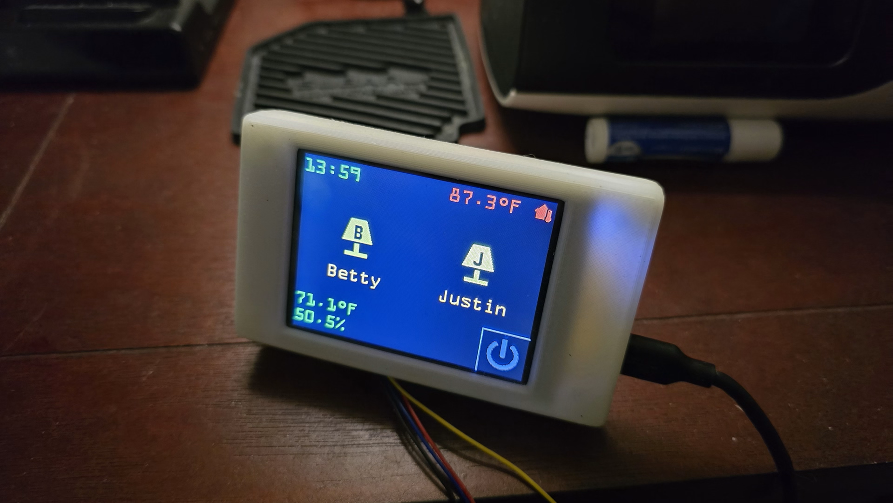
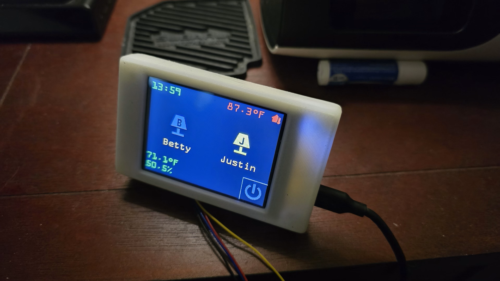
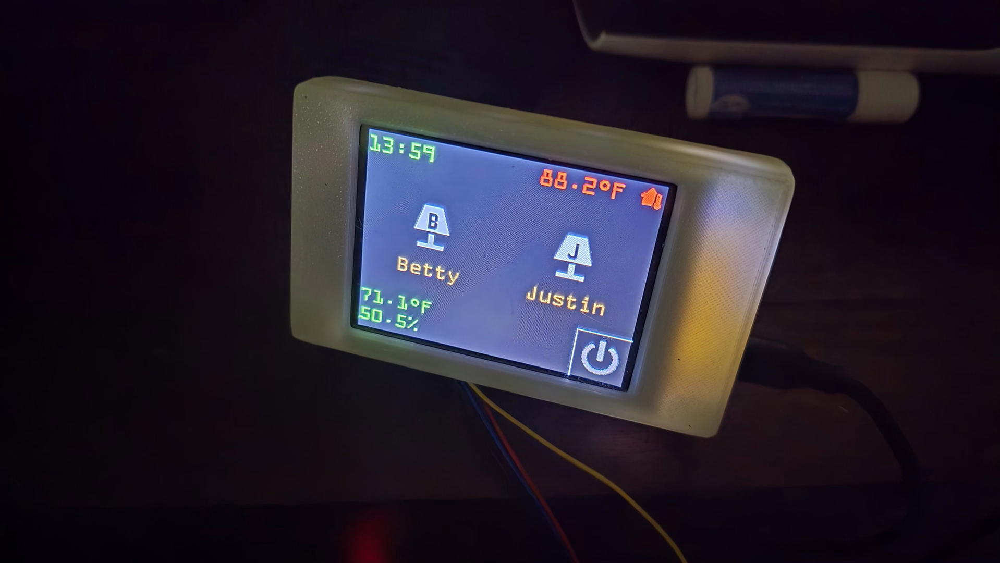

# Small Display Control Panel via ESPHome

Adjust the entity names in the yaml file to match your setup in homeassistant.

### Photos

Display shows Lamp status via colored icon, current time, outdoor tempature that changes color baised on tempature, and the room tempature and humidity

